<div align="center">

# 🛒 Smart Shopping Trolley with Billing System

### *IoT-Powered Real-Time Self-Checkout Using RFID & Arduino UNO*

[](https://www.arduino.cc/)
[](https://github.com/miguelbalboa/rfid)
[](https://en.wikipedia.org/wiki/Internet_of_things)
[](LICENSE)
[](https://github.com/)
[](CONTRIBUTING.md)

> 🚀 **A real-world IoT solution** to eliminate checkout queues in retail stores — an RFID-based smart trolley that automatically scans products and computes bills in real time, built after field surveys with actual shoppers and mall staff.

</div>

---

## 📋 Table of Contents

- [📌 Problem Statement](#-problem-statement)
- [💡 Solution & Approach](#-solution--approach)
- [🎯 Objectives](#-objectives)
- [🛠️ Technology Stack](#️-technology-stack)
- [📁 Project Structure](#-project-structure)
- [📐 Block Diagram](#-block-diagram)
- [🔬 How It Works — System Flowchart](#-how-it-works--system-flowchart)
- [🔌 Hardware & Circuit Setup](#-hardware--circuit-setup)
- [💻 Code Analysis](#-code-analysis)
- [📦 Libraries](#-libraries)
- [🚀 Installation & Setup](#-installation--setup)
- [🎬 System Demo](#-system-demo)
- [🌍 Impact & Real-World Significance](#-impact--real-world-significance)
- [🔮 Future Enhancements](#-future-enhancements)
- [🤝 Open Source Contribution](#-open-source-contribution)
- [📄 License](#-license)
- [👨‍💻 Author & Acknowledgments](#-author--acknowledgments)
- [📚 References](#-references)

---

## 📌 Problem Statement

> **"Long billing queues are the #1 customer complaint in modern retail — this project solves it at the trolley level."**

### Background

Retail shopping has grown rapidly, but the billing process remains the most frustrating bottleneck for customers. Traditional stores rely entirely on cashier counters, causing:
- Long queues during peak shopping hours (10–30 minutes)
- Manual billing errors leading to customer disputes
- High staffing costs for billing operations

### The Core Problem

| Challenge | Description |
|-----------|-------------|
| 🔴 **Checkout Queues** | Customers wait 10–30 minutes at billing counters during peak hours |
| 🔴 **Manual Billing Errors** | Human errors in price entry cause overcharging or undercharging |
| 🔴 **No Price Transparency** | Customers have no real-time view of running bill while shopping |
| 🔴 **High Staff Dependency** | Billing requires dedicated staff — costly and prone to absence |
| 🔴 **Slow Store Throughput** | Bottlenecks at counters reduce overall store capacity |

### Research Survey Findings

> *"Field surveys with shoppers at retail malls and interviews with store staff revealed critical real-world pain points — forming the research foundation for this project."*

- **78%** of surveyed customers identified billing queue time as their biggest shopping frustration
- **65%** said they would prefer a self-billing trolley if available
- **Retail staff** reported significant time savings when automated scanning replaced manual barcode scanning

[Abstract of the project](https://drive.google.com/file/d/1OxG_BkFMGthejRvPZT0m3bp7-5L1ClKi/view?usp=sharing)


---

## 💡 Solution & Approach

### Our Strategy

We embedded the entire checkout process directly into the shopping trolley using IoT hardware:

1. **Product Identification → RFID Tags** — Each product carries a passive RFID tag (no battery required)
2. **Real-Time Scanning → MFRC522 Reader** — Reader mounted on trolley detects tags at 13.56 MHz
3. **Bill Computation → Arduino UNO** — Microcontroller processes each scan and maintains running total
4. **Live Feedback → 16×2 I2C LCD** — Customer sees product name, price, and total in real time
5. **Self-Checkout → Checkout RFID Card** — One tap of a special card finalizes the bill
6. **Auto Reset → System Logic** — After 2 seconds, system resets for the next customer

### Architecture Overview

```
[RFID Tags on Products]
        ↓  RF Signal @ 13.56 MHz (passive, no battery in tags)
[MFRC522 RFID Reader]
        ↓  SPI Interface (10 Mbps)
[Arduino UNO — ATmega328P @ 16 MHz]
        ↓  I2C Interface
[16×2 LCD Display] → Product Name | Price | Total | Checkout Done
        ↓
[Serial Monitor] → UID Logs & Debug Output (Arduino IDE)
```

---

## 🎯 Objectives

- ✅ **Automate the scanning** of products using RFID technology without manual input
- ✅ **Display real-time billing** information on an embedded LCD display
- ✅ **Prevent duplicate charges** using a per-session scan guard
- ✅ **Enable self-checkout** via a dedicated checkout RFID card
- ✅ **Auto-reset** the system after each customer session
- ✅ **Provide a utility sketch** (`RFID_Card_Reader.ino`) for reading new RFID card UIDs
- ✅ **Make the solution open-source** for students, makers, and researchers to build upon

---

## 🛠️ Technology Stack

### Hardware Components

| Component | Specification | Role |
|-----------|--------------|------|
| **Arduino UNO** | ATmega328P, 16 MHz, 5V, 32KB Flash | Main microcontroller |
| **MFRC522 RFID Reader** | 13.56 MHz, SPI, ISO 14443 Type A | Reads RFID tags |
| **RFID Cards / Tags** | Passive, 4-byte UID | One per product + one checkout |
| **16×2 I2C LCD** | 16 columns × 2 rows, I2C address 0x27 | Real-time bill display |
| **Jumper Wires** | Male-to-Male / Male-to-Female | Circuit connections |
| **Breadboard** | 830-point standard | Prototyping |
| **Power Supply** | 5V USB / Battery pack | System power |
| **Shopping Trolley** | Standard retail cart | Physical mount |

### Software & Protocols

| Software / Protocol | Version | Purpose |
|--------------------|---------|---------|
| **Arduino IDE** | 1.8.x / 2.x | Programming & uploading firmware |
| **SPI Protocol** | — | Arduino ↔ MFRC522 communication |
| **I2C Protocol** | — | Arduino ↔ LCD communication |
| **UART / Serial** | 9600 baud | Arduino ↔ PC (debug logs) |
| **MFRC522 Library** | ≥1.4.0 | RFID reader interface |
| **LiquidCrystal_I2C** | ≥1.1.2 | I2C LCD control |
| **RFID_MFRC522v2** | v2.x | Extended MFRC522 support |

---

## 📦 Libraries

### Install in Arduino IDE

**Sketch → Include Library → Add .ZIP Library**, then add each of:

```
LiquidCrystal_I2C/    (included in project folder)
MFRC522/              (included in project folder)
RFID_MFRC522v2/       (included in project folder)
```

Or search and install via **Arduino Library Manager**:

```
Library Manager → Search "MFRC522"         → Install by GithubCommunity
Library Manager → Search "LiquidCrystal I2C" → Install by Frank de Brabander
```

### Built-in Libraries (No Install Needed)

```cpp
#include <SPI.h>     // SPI communication (built-in with Arduino IDE)
#include <Wire.h>    // I2C communication (built-in with Arduino IDE)
```

---

## 📁 Project Structure

```
Smart Shopping Trolley with Billing using Arduino UNO/
│
├── 📄 Smart_Shopping_Trolley_Billing.ino   # ⭐ Main billing firmware (core program)
├── 📄 RFID_Card_Reader.ino                 # 🔧 Utility: reads & prints RFID card UIDs
│
├── 📁 LiquidCrystal_I2C/                   # I2C LCD display library
│   ├── LiquidCrystal_I2C.h
│   ├── LiquidCrystal_I2C.cpp
│   └── examples/
│
├── 📁 MFRC522/                             # RFID MFRC522 reader library
│   ├── src/
│   ├── examples/
│   └── README.rst
│
├── 📁 RFID_MFRC522v2/                      # MFRC522 v2 extended library
│   └── ...
│
├── 📁 images/
│   ├── 1.png                               # Block diagram
│   ├── 2.jpg                               # Hardware setup photo
│   ├── 3.gif                               # System demo animation
│   └── 3.mp4                              # System demo video
│
├── Abstract of Smart Shopping Trolly Billing System.pdf
├── Presentation of Smart Shopping Trolley Billing System.pdf
├── Report of Smart Shopping Trolley System.pdf
└── README.md
```

---

## 📐 Block Diagram


---

## 🔬 How It Works — System Flowchart

```mermaid
flowchart TD
    A([🔌 Power ON / System Start]) --> B[Initialize SPI, RFID, I2C LCD]
    B --> C[LCD: 'Scan your card']
    C --> D{New RFID Card\nDetected?}
    D -- No --> D
    D -- Yes --> E[Read & Format UID\nto Uppercase HEX]
    E --> F[Log UID to\nSerial Monitor]
    F --> G{Is Checkout\nCard?}

    G -- Yes --> H{Checkout\nAlready Done?}
    H -- Yes --> D
    H -- No --> I[LCD: 'Checkout Done'\nLCD: 'Total: Rs.XX']
    I --> J[Set checkoutDone = true]
    J --> K[Wait 2 Seconds]
    K --> L[resetSystem:\nClear all flags\nTotal = 0]
    L --> C

    G -- No --> M{Match in\nProduct UID List?}
    M -- No --> D
    M -- Yes --> N{Already\nScanned?}
    N -- Yes --> O[LCD: 'Already added:\nProductName']
    O --> D
    N -- No --> P[Mark as Scanned\nAdd Price to Total]
    P --> Q[LCD: ProductName\nLCD: Rs.Price]
    Q --> R[Delay 1 Second]
    R --> S[PICC_HaltA\nStopCrypto1]
    S --> D

    style A fill:#2e7d32,color:#fff
    style L fill:#1565c0,color:#fff
    style I fill:#f57f17,color:#fff
    style O fill:#b71c1c,color:#fff
    style P fill:#1b5e20,color:#fff
```



### Step-by-Step Operation

| Step | Action | Description |
|------|--------|-------------|
| 1 | **Power ON** | Arduino initializes RFID reader and LCD, shows `"Scan your card"` |
| 2 | **RFID Scan** | Customer places product near reader; UID is read over SPI |
| 3 | **UID Matching** | Firmware compares scanned UID to stored product UID list |
| 4 | **First Scan** | Product name + price shown on LCD; price added to running total |
| 5 | **Duplicate Scan** | `"Already added: [Product]"` shown — no duplicate charge |
| 6 | **Checkout Scan** | Customer taps Checkout card → LCD shows `"Total: Rs.XX"` |
| 7 | **Auto Reset** | After 2 seconds, all flags cleared, system ready for next customer |

---

## 🔌 Hardware & Circuit Setup

### MFRC522 RFID Reader → Arduino UNO Wiring

| MFRC522 Pin | Arduino UNO Pin | Signal |
|-------------|----------------|--------|
| SDA (SS)    | **Pin 10**     | SPI Slave Select |
| SCK         | **Pin 13**     | SPI Clock |
| MOSI        | **Pin 11**     | SPI Master Out |
| MISO        | **Pin 12**     | SPI Master In |
| RST         | **Pin 9**      | Reset |
| GND         | GND            | Ground |
| 3.3V        | **3.3V**       | Power ⚠️ NOT 5V |
| IRQ         | Not Connected  | — |

> ⚠️ **Critical:** Always power the MFRC522 with **3.3V**. Connecting to 5V will permanently damage the module.

### I2C LCD (16×2) → Arduino UNO Wiring

| LCD Pin | Arduino UNO Pin | Signal |
|---------|----------------|--------|
| VCC     | 5V             | Power |
| GND     | GND            | Ground |
| SDA     | **A4**         | I2C Data |
| SCL     | **A5**         | I2C Clock |

---

## 💻 Code Analysis

### Main Program: `Smart_Shopping_Trolley_Billing.ino`

#### Key Data Structures

```cpp
// RFID Card UIDs mapped to products
String cardUIDs[4] = {
  "EF 69 35 1E",  // Milk     → Product 0
  "F3 AB DD E2",  // Bread    → Product 1
  "63 97 60 E4",  // Juice    → Product 2
  "97 8B 7A 00"   // Checkout → Finalizes bill
};

String productNames[3]   = {"Milk", "Bread", "Juice"};
int    productPrices[3]  = {30, 20, 25};             // in Rupees
bool   productScanned[3] = {false, false, false};    // Duplicate guard
int    totalAmount       = 0;
bool   checkoutDone      = false;
```

#### UID Reading Logic

```cpp
// Reads raw bytes of UID, zero-pads, formats as uppercase HEX string
String scannedUID = "";
for (byte i = 0; i < rfid.uid.size; i++) {
    if (rfid.uid.uidByte[i] < 0x10) scannedUID += "0"; // Zero-pad single digits
    scannedUID += String(rfid.uid.uidByte[i], HEX);
    if (i < rfid.uid.size - 1) scannedUID += " ";
}
scannedUID.toUpperCase(); // e.g. → "EF 69 35 1E"
```

#### Anti-Duplicate Mechanism

```cpp
if (!productScanned[i]) {
    productScanned[i] = true;        // Mark as scanned this session
    totalAmount += productPrices[i]; // Add to bill once only
    // Display product name & price on LCD
} else {
    // Display "Already added: ProductName" warning
}
```

#### System Reset Logic

```cpp
void resetSystem() {
    totalAmount = 0;
    for (int i = 0; i < 3; i++) productScanned[i] = false;
    checkoutDone = false;
    lcd.clear();
    lcd.setCursor(0, 0);
    lcd.print("Restarted...");
    delay(1000);
    lcd.clear();
    lcd.setCursor(0, 0);
    lcd.print("Scan your card"); // Ready for next customer
}
```

### Design Decisions

| Decision | Rationale |
|----------|-----------|
| **`bool productScanned[]`** | In-memory session flag prevents duplicate billing without EEPROM writes |
| **SPI for RFID** | Fast (up to 10 Mbps) and reliable; MFRC522 natively uses SPI |
| **I2C for LCD** | Only 2 wires (SDA + SCL); saves digital pins for other potential sensors |
| **`delay(1000)` after scan** | Debounce — prevents same card from being read multiple times in one placement |
| **PICC_HaltA + StopCrypto1** | Properly halts card communication; prevents interference in multi-card environments |
| **Auto-reset after 2s** | Ensures the trolley is ready for the next customer without a manual restart |

---

### Utility Program: `RFID_Card_Reader.ino`

This sketch is used **during initial setup only** — to discover the UID of each RFID card before hardcoding them into the billing firmware.

**How to Use:**
1. Upload `RFID_Card_Reader.ino` to Arduino UNO
2. Open **Serial Monitor** (baud: 9600)
3. Tap each product RFID card → note the printed UID
4. Paste those UIDs into `cardUIDs[]` in `Smart_Shopping_Trolley_Billing.ino`

```cpp
// Dumps full card details including UID, type, and data blocks
mfrc522.PICC_DumpToSerial(&(mfrc522.uid));
```

---

## 🚀 Installation & Setup

### Prerequisites

- [Arduino IDE](https://www.arduino.cc/en/software) (v1.8.x or v2.x)
- Arduino UNO + USB cable
- MFRC522 RFID module
- 16×2 I2C LCD display
- RFID cards/tags (minimum 4: 3 products + 1 checkout)

### 1. Clone the Repository

```bash
git clone https://github.com/ArokiyaNithish/Smart-Shopping-Trolley.git
cd Smart-Shopping-Trolley
```

### 2. Install Libraries

Open Arduino IDE → **Sketch → Include Library → Add .ZIP Library**

Add all three library folders:
```
LiquidCrystal_I2C/
MFRC522/
RFID_MFRC522v2/
```

### 3. Read Your RFID Card UIDs

```bash
# Open RFID_Card_Reader.ino in Arduino IDE
# Upload to Arduino UNO
# Open Serial Monitor at 9600 baud
# Tap each RFID card → note the UID printed
```

### 4. Configure Product UIDs

Open `Smart_Shopping_Trolley_Billing.ino` and update:

```cpp
String cardUIDs[4] = {
  "XX XX XX XX",  // Your Product 1 UID (e.g. Milk)
  "XX XX XX XX",  // Your Product 2 UID (e.g. Bread)
  "XX XX XX XX",  // Your Product 3 UID (e.g. Juice)
  "XX XX XX XX"   // Your Checkout card UID
};

String productNames[3]  = {"Milk", "Bread", "Juice"}; // Update names
int    productPrices[3] = {30, 20, 25};                // Update prices (Rs.)
```

### 5. Upload & Test

1. Select board: **Tools → Board → Arduino UNO**
2. Select port: **Tools → Port → COMx**
3. Upload `Smart_Shopping_Trolley_Billing.ino`
4. LCD shows `"Scan your card"` → system is live!

---

## 🌍 Impact & Real-World Significance

### Who Benefits

| Stakeholder | Benefit |
|-------------|---------|
| 🛒 **Customers** | Zero wait time at checkout; real-time bill visibility |
| 🏪 **Retailers** | Reduced cashier staff costs; faster store throughput |
| 👩‍💼 **Store Staff** | Staff freed from billing to assist customers on floor |
| ♿ **Elderly / Specially-Abled** | Fully independent self-checkout without cashier help |
| 🌱 **Environment** | Reduces paper receipts and manual printed records |

### System vs. Traditional Checkout

| Traditional Checkout | Smart Trolley System |
|---------------------|---------------------|
| 10–30 min queue | **Instant** self-checkout |
| Human billing errors | **00 errors** — automated UID matching |
| Dedicated cashier required | **No cashier** needed at billing |
| No price visibility while shopping | **Live running bill** on LCD |
| Cannot scale during peak hours | **Scales infinitely** — one system per trolley |

---

## 🎬 System Demo

| State | LCD Display | Event |
|-------|------------|-------|
| **Idle** | `Scan your card` | System waiting |
| **Product Scanned (1st)** | `Milk` / `Rs.30` | Item added to bill |
| **Duplicate Scan** | `Already added:` / `Milk` | No charge added |
| **Checkout** | `Checkout Done` / `Total: Rs.75` | Bill finalized |
| **Reset** | `Restarted...` → `Scan your card` | Ready for next customer |

### Working Prototype Image 


# Working Prototype Video

https://github.com/user-attachments/assets/b8952683-16bd-446f-ae13-77423ad2ea24

---


## 🔮 Future Enhancements

- [ ] **Wi-Fi Integration** (ESP8266/ESP32) — send bill to cloud server in real time
- [ ] **Mobile App** (Android/Flutter) — customer receives digital receipt on phone
- [ ] **Weight Sensor** — detect if item added without RFID scan (anti-theft)
- [ ] **Payment Module** — display UPI QR code on screen for contactless payment
- [ ] **OLED Display** — better visuals and graphical bill display
- [ ] **Barcode Fallback** — handle products without RFID tags via barcode scanner
- [ ] **Inventory Sync** — deduct stock count on successful checkout
- [ ] **Voice Feedback** — small speaker confirms each scanned item
- [ ] **Multi-language** — Regional language support for product names on LCD
- [ ] **Store Dashboard** — centralized web dashboard for all trolleys in real time

---

## 🤝 Open Source Contribution

We warmly welcome contributions from the community! Whether it's **hardware improvements**, **new features**, **documentation**, or **bug fixes** — every contribution matters! 🎉

### How to Contribute

```bash
# 1. Fork the repository on GitHub

# 2. Clone your fork
git clone https://github.com/YOUR_USERNAME/Smart-Shopping-Trolley.git
cd Smart-Shopping-Trolley

# 3. Create a feature branch
git checkout -b feature/your-feature-name

# 4. Make your changes and commit
git add .
git commit -m "feat: add ESP8266 WiFi billing sync"

# 5. Push to your fork
git push origin feature/your-feature-name

# 6. Open a Pull Request → main branch on GitHub
```

### Contribution Areas

| Area | Good First Issue? | Description |
|------|------------------|-------------|
| 🐛 **Bug Fixes** | ✅ Yes | Fix edge cases in UID matching or LCD display |
| ➕ **More Products** | ✅ Yes | Extend system to support 10+ products |
| 🖥️ **OLED Support** | ✅ Yes | Add OLED display as alternative to LCD |
| 📡 **Wi-Fi Module** | ⚡ Medium | Integrate ESP8266 for cloud billing |
| 📱 **Mobile App** | ⚡ Medium | Flutter/Android companion app for digital receipt |
| 🧪 **Testing** | ✅ Yes | Hardware test scripts and simulation |
| 📖 **Documentation** | ✅ Yes | Tutorials, wiring diagrams, video walkthroughs |
| 🔊 **Voice Feedback** | ⚡ Medium | Buzzer or speaker for audio product confirmation |
| ⚖️ **Weight Sensor** | 🔥 Advanced | Anti-theft detection for unscanned items |

### Coding Standards

- Comment your code clearly — explain the *why*, not just the *what*
- Use descriptive variable names
- Write meaningful commit messages using [Conventional Commits](https://www.conventionalcommits.org/)
- Test your changes on actual hardware before submitting a PR
- Reference any related issue number in your PR description

### Reporting Issues

Please use [GitHub Issues](https://github.com/ArokiyaNithish/Smart-Shopping-Trolley/issues) to:
- 🐛 Report bugs
- 💡 Request features
- ❓ Ask questions or get help

---

## 📄 License

This project is licensed under the **MIT License** — completely free to use, modify, and distribute.

```
MIT License

Copyright (c) 2025 Arokiya Nithish

Permission is hereby granted, free of charge, to any person obtaining a copy
of this software and associated documentation files (the "Software"), to deal
in the Software without restriction, including without limitation the rights
to use, copy, modify, merge, publish, distribute, sublicense, and/or sell
copies of the Software, and to permit persons to whom the Software is
furnished to do so, subject to the following conditions:

The above copyright notice and this permission notice shall be included in all
copies or substantial portions of the Software.
```

See [LICENSE](LICENSE) for full details.

---

## 👨‍💻 Author & Acknowledgments

### Author

**Arokiya Nithish J**
- 🎓 Engineering Student | IoT & Embedded Systems Enthusiast
- 💼 Domain: IoT | Arduino | RFID | Embedded C

**Contacts**
- GitHub: [@ArokiyaNithish](https://github.com/ArokiyaNithish)
- LinkedIn: [@Arokiya Nithish J](https://www.linkedin.com/in/arokiya-nithishj/)
- Email: arokiyanithishj@gmail.com
- Portfolio: [arokiyanithish.github.io/portfolio](https://arokiyanithish.github.io/portfolio/)

### Acknowledgments

- 🏪 **Retail Mall Shoppers & Staff** — For participating in field surveys that shaped this project's requirements
- 📡 **miguelbalboa** — For the open-source [MFRC522 Arduino Library](https://github.com/miguelbalboa/rfid)
- 🖥️ **Frank de Brabander** — For the [LiquidCrystal_I2C Library](https://github.com/johnrickman/LiquidCrystal_I2C)
- 🔧 **Arduino Community** — For the incredible open-source hardware and software ecosystem
- 📚 **OSSLibraries** — For the [MFRC522v2 extended library](https://github.com/OSSLibraries/Arduino_MFRC522v2)

---

## 📚 References

1. [Report Completed Documentation of the Project](https://drive.google.com/file/d/1o-lwD_c-iPc-EA-hjFGMlGl0T8WRGI06/view?usp=sharing)
2. [Presenation of the project](https://drive.google.com/file/d/1Vs6lxVuLPYohq5XWtYXF8uZrqahKCH-Q/view?usp=sharing)
2. [Arduino UNO Official Documentation](https://www.arduino.cc/en/microcontrollers/uno-rev3)
3. [MFRC522 Library — miguelbalboa/rfid (GitHub)](https://github.com/miguelbalboa/rfid)
4. [Arduino MFRC522v2 Library — OSSLibraries (GitHub)](https://github.com/OSSLibraries/Arduino_MFRC522v2)
5. [LiquidCrystal I2C Library — johnrickman (GitHub)](https://github.com/johnrickman/LiquidCrystal_I2C)
6. [RFID Technology Overview — Wikipedia](https://en.wikipedia.org/wiki/Radio-frequency_identification)
7. [Arduino SPI Library Reference](https://www.arduino.cc/en/reference/SPI)
8. [Arduino Wire (I2C) Library Reference](https://www.arduino.cc/en/reference/wire)
9. [ISO/IEC 14443 — RFID Standard for Contactless Cards](https://www.iso.org/standard/70171.html)

---

<div align="center">

For support, email arokiyanithishj@gmail.com or open an [issue](https://github.com/ArokiyaNithish/Smart-Shopping-Trolley/issues) on GitHub.

### 🌟 If this project helped you — please give it a ⭐ Star on GitHub!

**#IoT #Arduino #RFID #SmartShopping #EmbeddedSystems #OpenSource**

*Made with ❤️ and Arduino by Arokiya Nithish*

</div>
